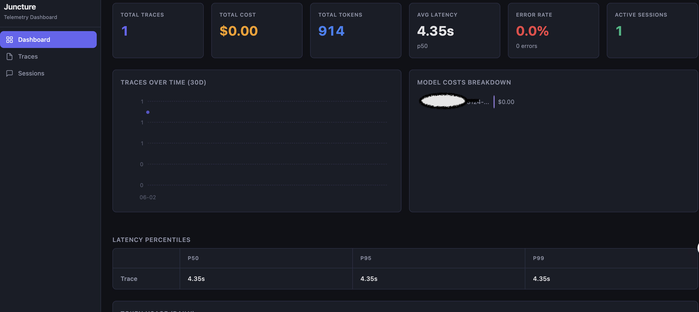
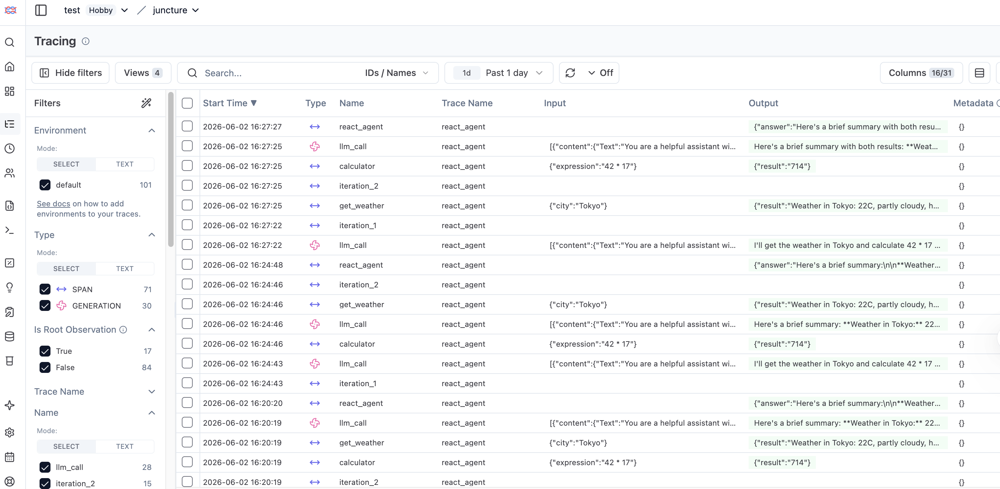
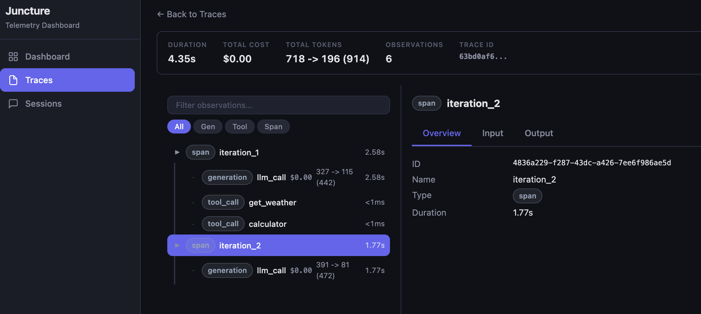

# Juncture

English | [中文](README.zh.md)

A Rust implementation of [LangGraph](https://github.com/langchain-ai/langgraph)'s state machine framework for building LLM agent applications.

Juncture preserves the core programming model -- `StateGraph` + Pregel execution engine -- while leveraging Rust's type system for compile-time safety and true multi-core parallelism. The API design stays close to LangGraph Python so that developers familiar with the original can transfer their knowledge directly.

## Acknowledgments

This project would not exist without [LangGraph](https://github.com/langchain-ai/langgraph). The programming model, execution semantics, and API design are derived from LangGraph's architecture. We are deeply grateful to the LangChain team for their pioneering work on graph-based agent orchestration.

During development, we also studied and learned from several Rust community efforts in the same space:

| Project | What We Learned |
|---------|----------------|
| [rust-langgraph](https://github.com/lookfirst/rust-langgraph) | Early proof that LangGraph's model maps well to Rust traits |
| [oxidizedgraph](https://github.com/nicholasgasior/oxidizedgraph) | Patterns for async graph execution with tokio |
| [cognis](https://github.com/cognis/cognis) | Multi-crate workspace organization for agent frameworks |

Each of these projects explored different trade-offs in adapting LangGraph to Rust. Juncture builds on their insights while taking a different approach: prioritizing semantic equivalence with LangGraph Python over novel abstractions.

## Why Rust?

The performance advantage comes primarily from Rust's runtime characteristics, not from clever engineering. When your nodes execute in a `tokio::spawn` work-stealing scheduler instead of Python's single-threaded asyncio, parallelism happens naturally.

That said, the benchmarks do show meaningful differences. Here is a summary (full methodology and caveats in [`benchmarks/README.md`](benchmarks/README.md)):

| Scenario | Juncture (Rust) | LangGraph (Python) | Speedup |
|----------|----------------|-------------------|---------|
| Sequential 3000 nodes | 16.9 ms | 7,652 ms | 452x |
| Streaming 10000 nodes | 142.7 ms | 78,085 ms | 547x |
| Fanout 100 subjects | 1.35 ms | 566 ms | 420x |
| Wide State 1200 iter | 95.4 ms | 3,593 ms | 38x |
| Conditional Routing 50 | 0.7 ms | 3.9 ms | 5.6x |

**Important**: These numbers reflect framework overhead on no-op nodes. Real-world LLM calls dominate execution time, making the framework overhead difference negligible in practice. The value of Rust here is more about type safety, memory efficiency, and deployment flexibility than raw speed.

## Features

### Core (juncture-core)

- `#[derive(State)]` -- compile-time typed state with per-field reducers (`replace`, `append`, `ephemeral`, `last_write_wins`, `custom`)
- `StateGraph` builder with `add_node`, `add_edge`, `add_conditional_edges`
- Pregel execution engine with `tokio::spawn` + `JoinSet` for true parallel execution
- `CowState<S>` (Arc-based copy-on-write) to avoid expensive state clones
- `Command<S>` for node return routing (goto, resume, parent navigation)
- `Send` for dynamic fan-out to parallel subgraphs
- `interrupt!` macro for human-in-the-loop workflows
- Streaming with 9 modes (Values, Updates, Messages, Custom, Debug, Tools, Checkpoints, Tasks, Multi)
- `Store` trait for cross-thread persistent key-value storage
- `RetryPolicy` and `TimeoutPolicy` per node
- `Durability` modes (Sync, Async, Exit)
- `Runtime<C>` for context injection, heartbeat, and execution info

### Checkpoint (juncture-checkpoint)

- `MemorySaver` for development
- `SqliteSaver` and `PostgresSaver` for production
- Serialization backends: JSON, MessagePack, JSON+, AES-256-GCM encrypted
- Incremental write persistence (`put_writes` per task completion)

### LLM Integration (juncture facade)

- `ChatModel` trait with providers: OpenAI, Anthropic, Ollama
- `Tool` trait with `ToolNode`, interceptors, and transformers
- `create_react_agent()` factory for ReAct-style agents
- `AgentMiddleware` chain (loop detection, error handling)
- `SubagentTool` and `AgentRegistry` for multi-agent delegation
- `RetryingModel` wrapper with configurable retry policy
- Structured output extraction via `schemars`
- `CircuitBreaker` for provider health tracking

### Observability

**juncture-tracing** -- OpenTelemetry integration:
- Node-level spans with token usage metrics
- `GraphCallbackHandler` lifecycle callbacks
- Cross-service trace context propagation

**juncture-telemetry** -- Langfuse-compatible embedded observability:
- One-line setup: `init().with_store("db").with_langfuse_from_env().with_dashboard(8123).install().await?`
- SQLite-backed trace/observation/session storage
- Embedded web dashboard with trace tree, observation detail, cost/token charts
- Langfuse cloud export (auto-reads `LANGFUSE_*` env vars)
- Langfuse-compatible REST API (traces, sessions, stats, ingestion)
- OTLP HTTP ingest
- Multi-agent tracing via nested observation trees
- RAII auto-flush on drop + signal handler for graceful shutdown

| Local Dashboard | Langfuse Cloud Sync |
|:---:|:---:|
|  |  |
|  | |

### WASM Support

- Browser (`wasm32-unknown-unknown`) via `wasm-bindgen`
- Edge CLI (`wasm32-wasip1`) via WASI
- Edge HTTP server via Fermyon Spin
- Feature-gated: `wasm` feature flag, `web-time` for `Instant`, `getrandom` with `wasm_js`

## Quick Start

Add to your `Cargo.toml`:

```toml
[dependencies]
juncture = "0.1"
tokio = { version = "1", features = ["macros", "rt-multi-thread"] }
serde = { version = "1", features = ["derive"] }
```

### Basic Example

```rust
use juncture::prelude::*;
use serde::{Deserialize, Serialize};

#[derive(State, Clone, Debug, Serialize, Deserialize)]
struct MyState {
    #[reducer(replace)]
    count: i32,
    #[reducer(append)]
    history: Vec<String>,
}

async fn increment(state: &MyState) -> Result<MyState::Update> {
    Ok(MyStateUpdate {
        count: Some(state.count + 1),
        history: Some(vec![format!("count -> {}", state.count + 1)]),
    })
}

#[tokio::main]
async fn main() -> Result<()> {
    let mut graph = StateGraph::<MyState>::new();
    graph.add_node("increment", increment);
    graph.add_edge(START, "increment");
    graph.add_edge("increment", END);

    let compiled = graph.compile()?;
    let result = compiled.invoke(MyState { count: 0, history: vec![] }, &RunnableConfig::default()).await?;
    println!("Result: {:?}", result);
    Ok(())
}
```

### ReAct Agent with Tools

```rust
use juncture::prelude::*;
use juncture::tools::Tool;
use juncture::llm::ChatOpenAI;

// Define tools, create agent
let model = ChatOpenAI::new("gpt-4o")?;
let agent = create_react_agent(model, vec![my_tool])?;
let result = agent.invoke(input, &config).await?;
```

See the [`examples/`](examples/) directory for 15 progressive examples, from basic state machines to production LLM pipelines.

## Examples

| # | Example | Concepts |
|---|---------|----------|
| 01 | State Machine | `#[derive(State)]`, linear graph, `invoke()` |
| 02 | Counter Reducers | `#[reducer(append)]`, `#[reducer(last_write_wins)]` |
| 03 | Conditional Routing | `Router` trait, `PathMap`, `add_conditional_edges` |
| 04 | Chat Basic | `MessagesState`, `Message`, `MockChatModel` |
| 05 | Tool Calling | `Tool` trait, `ToolNode`, manual agent graph |
| 06 | Streaming | `stream()`, `StreamMode`, `StreamEvent` |
| 07 | Human-in-the-Loop | `CompileConfig` interrupts, `interrupt_before` |
| 08 | Checkpoint Resume | `MemorySaver`, `compile_with_checkpointer()`, thread_id |
| 09 | Error Recovery | Result propagation, error handling with `?` |
| 10 | Basic Chat | `ChatOpenAI`, single/multi-turn with real LLM |
| 11 | Streaming Chat | `ChatModel::stream`, token-by-token display |
| 12 | Tool Execution | `bind_tools`, tool execution loop with real LLM |
| 13 | ReAct Agent | `create_react_agent`, weather + math tools |
| 14 | Multi-turn | Conversation history accumulation, system prompts |
| 15 | Structured Output | `ToolChoice::Required`, JSON entity extraction |
| 16 | Telemetry | `init()` builder, Langfuse dashboard, cloud export, real LLM + tools |
| -- | Deep Research | Multi-agent research assistant (separate package) |
| -- | WASM Example | Browser-based graph execution via wasm-bindgen |
| -- | WASM Edge CLI | WASI standalone binary |
| -- | WASM Edge Server | Fermyon Spin HTTP edge service |

```bash
# Run any mock example (no API key needed)
cargo run -p juncture-simple-example --bin 01_state_machine

# Run a real LLM example (requires .env with OPENAI_API_KEY)
cargo run -p juncture-simple-example --bin 13_react_agent
```

## Workspace Structure

```
juncture/
  crates/
    juncture/            # Facade crate -- LLM providers, tools, prebuilt agents
    juncture-core/       # Channel system, StateGraph, Pregel engine, Node/Edge
    juncture-derive/     # #[derive(State)] proc-macro
    juncture-checkpoint/ # MemorySaver, SqliteSaver, PostgresSaver
    juncture-tracing/    # OpenTelemetry integration
    juncture-telemetry/  # Langfuse-compatible embedded observability
    juncture-store/      # Cross-thread persistent key-value storage
  benchmarks/            # Juncture vs LangGraph performance comparison
  examples/              # 16 examples + deep-research + WASM demos
  design/                # Architecture design documents (11 modules)
```

## Build & Test

```bash
# Build everything
cargo build --workspace --all-features

# Run all tests
cargo test --workspace --all-targets --all-features

# Lint (zero warnings policy)
cargo clippy --workspace --all-targets --all-features -- -D warnings

# Format check
cargo fmt --all -- --check

# Run benchmarks
cargo bench -p juncture-benchmarks
```

## Comparison with Other Rust Implementations

Juncture takes a specific position among Rust LangGraph implementations:

| Aspect | Juncture | Other Rust Ports |
|--------|----------|-----------------|
| **Goal** | Semantic equivalence with LangGraph Python | Novel abstractions or subsets |
| **State system** | `#[derive(State)]` proc-macro with per-field reducers | Manual trait impls or dynamic maps |
| **Channel model** | Static, compile-time verified | Dynamic or simplified |
| **Execution** | Full Pregel with field-version scheduling | Simplified sequential or basic parallel |
| **Feature coverage** | HITL, subgraphs, Send, streaming, checkpoints, Store | Partial coverage |
| **Observability** | Langfuse-compatible embedded dashboard + cloud export + OTLP | Not typically supported |
| **WASM** | Browser + WASI + Spin edge | Not typically supported |
| **Maturity** | Early stage, design-driven | Varies |

The trade-off is clear: Juncture prioritizes completeness and compatibility over simplicity. If you need a lightweight graph executor, other options may be more suitable. If you want to port a LangGraph application to Rust with minimal semantic changes, Juncture is designed for that.

## Roadmap

- [x] Production hardening (error recovery, resource limits)
- [x] Performance optimization for wide-state scenarios
- [ ] Additional LLM providers
- [x] Graph visualization tooling
- [ ] LangGraph Platform API compatibility

## Contributing

Contributions are welcome. Please ensure:

- `cargo clippy --workspace --all-targets --all-features -- -D warnings` passes with zero warnings
- `cargo fmt --all -- --check` passes
- All tests pass
- No `unwrap()`, `todo!()`, or `unimplemented!()` in committed code

## License

Licensed under either of [Apache License, Version 2.0](http://www.apache.org/licenses/LICENSE-2.0)
